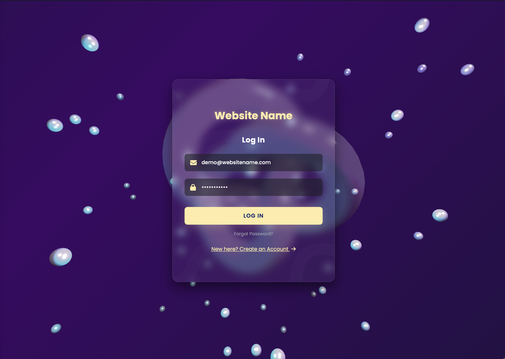

# 3D Animated Login Interface

  

 

A beautifully crafted, modern authentication interface featuring an interactive **3D animated background** and a sleek **glassmorphism** UI card with a 3D flip effect.

## ✨ Features

- **Immersive 3D Background**: Powered by Three.js, the background features a fluid, glowing frosted-glass Torus Knot surrounded by floating light spheres. The 3D scene responds gently to mouse movements, creating a premium parallax effect.
- **Glassmorphism UI**: The authentication card utilizes modern CSS backdrop-filters to create a stunning frosted glass look that beautifully overlays the 3D background.
- **3D Flip Animation**: Smooth CSS 3D transforms allow the user to flip the card seamlessly between the "Log In" and "Sign Up" views.
- **Custom Modal Popups**: Includes custom-built, animated modal popups for success messages (e.g., upon logging in or creating an account), replacing standard alerts.
- **Responsive Design**: Adapts beautifully to different screen sizes, ensuring a flawless experience on both desktop and mobile devices.
- **Modern Styling**: Combines the utility-first power of Tailwind CSS with custom CSS for highly specific UI components and animations.

## 🛠️ Tech Stack

- **HTML5 & CSS3**
- **Tailwind CSS** (via CDN for rapid utility styling)
- **Three.js** (via CDN for WebGL 3D graphics)
- **Vanilla JavaScript** (for logic, 3D rendering loop, and form handling)
- **FontAwesome** (for crisp vector icons)
- **Google Fonts** (Poppins font family)

## 🚀 How to Run

This project runs completely in the browser and requires no complex build tools or dependencies to be installed locally.

1. Clone or download the repository to your local machine.
2. Simply double-click the `3d card login flip.html` file to open it in your preferred modern web browser.
3. Enjoy the interactive 3D experience!

## 💡 Customization

- **Background Colors**: You can easily change the gradient background colors in the `#canvas-container` CSS block.
- **3D Lighting**: The neon colors of the 3D scene can be modified in the JavaScript section by updating the hex values of the `THREE.PointLight` objects (currently Purple `#8b5cf6` and Cyan `#06b6d4`).
- **3D Shapes**: The main glowing shape and particles can be customized by exploring different Three.js geometries.

---
*Built with modern web standards and a focus on premium aesthetics.*
